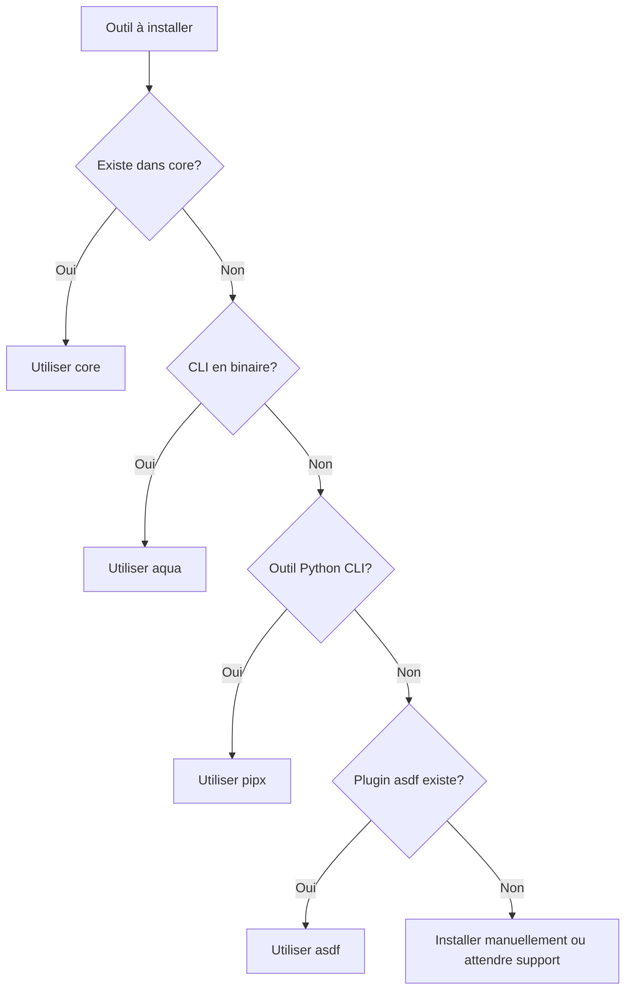

# Les backends `mise` : choisir la source de ses outils

**Chapo :** `mise` ne réinvente pas la roue : il s'appuie sur des backends existants pour installer vos outils. Comprendre ces backends permet de choisir la bonne source pour chaque outil et d'éviter les conflits ou les installations redondantes.

## Introduction

Lorsque vous installez un outil avec `mise use java`, `mise` doit savoir *où* et *comment* récupérer cet outil. C'est le rôle des **backends** : ce sont les sources d'installation que `mise` interroge pour télécharger, compiler ou gérer les différentes versions de vos outils.

Comprendre les backends permet de :
- **choisir la source la plus adaptée** à chaque outil (rapidité, maintenabilité, sécurité),
- **éviter les conflits** entre gestionnaires de paquets,
- **affiner ses configurations** pour des besoins spécifiques (miroirs internes, builds personnalisés).

Dans cet article :
- Les 4 principaux backends (`core`, `asdf`, `aqua`, `pipx`)
- Quand et comment les utiliser
- Comment spécifier explicitement un backend dans `mise.toml`

## En bref

- `mise` délègue l'installation des outils à des **backends** (sources d'installation)
- Le backend **`core`** est maintenu par l'équipe `mise` et couvre les outils les plus courants (Node, Python, Java, Terraform…)
- Le backend **`asdf`** permet d'utiliser les plugins `asdf` existants pour des outils non couverts par `core`
- **`aqua`** et **`pipx`** sont des backends spécialisés pour des outils distribués via ces gestionnaires
- On peut **spécifier explicitement le backend** dans `mise.toml` pour éviter l'ambiguïté ou forcer une source

## Les backends disponibles

### Le backend `core`

Le backend **`core`** est développé et maintenu directement par l'équipe `mise`. Il couvre les outils les plus utilisés dans les environnements de développement moderne.

**Outils couverts :**
- langages : `node`, `python`, `java`, `go`, `ruby`, `rust`, `bun`, `deno`
- outils cloud et infra : `terraform`, `kubectl`, `helm`, `awscli`, `gcloud`
- outils système : `direnv`, `jq`, `yq`, `fd`, `rg`

**Avantages :**
- **rapide** : optimisé pour `mise`, pas de dépendance externe
- **maintenable** : suivi des versions officielles, mises à jour régulières
- **stable** : moins de risque de casse ou de comportement inattendu

**Quand l'utiliser :**
Si l'outil est disponible dans `core`, **privilégiez ce backend**. C'est le choix par défaut de `mise`.

```bash
# Installe Node via le backend core
mise use node@20
```

### Le backend `asdf`

Le backend **`asdf`** permet d'utiliser les plugins existants de l'écosystème `asdf-vm`. Cela étend considérablement le catalogue d'outils disponibles.

**Avantages :**
- **écosystème riche** : des centaines de plugins communautaires
- **compatibilité** : migrer depuis `asdf` devient trivial
- **flexibilité** : plugins pour des outils très spécifiques

**Inconvénients :**
- **qualité variable** : certains plugins sont peu maintenus
- **performances** : parfois plus lent que `core` (compilation, scripts bash…)
- **dépendances** : nécessite souvent des outils systèmes supplémentaires

**Quand l'utiliser :**
Uniquement si l'outil n'existe **pas dans `core`** ou si vous avez besoin d'un comportement spécifique d'un plugin `asdf`.

```bash
# Installe Elixir via un plugin asdf
mise use asdf:elixir@1.16
```

### Le backend `aqua`

**`aqua`** est un gestionnaire de paquets pour outils CLI, distribué sous forme de binaires. `mise` peut l'utiliser comme backend.

**Avantages :**
- **binaires pré-compilés** : installation ultra-rapide
- **nombreux outils** : CLI GitHub, Terraform modules, outils DevOps
- **reproductibilité** : basé sur des lockfiles stricts

**Inconvénients :**
- **moins universel** : ne couvre pas les langages (Node, Python…)
- **backend supplémentaire** : une couche d'abstraction en plus

**Quand l'utiliser :**
Pour des outils CLI spécifiques non couverts par `core` ou pour bénéficier de l'écosystème `aqua` si vous l'utilisez déjà.

```bash
# Installe hadolint via aqua
mise use aqua:hadolint/hadolint@2.12.0
```

### Le backend `pipx`

**`pipx`** installe des outils Python en isolation (chaque outil dans son propre virtualenv).

**Avantages :**
- **isolation** : pas de conflits de dépendances Python
- **simplicité** : idéal pour les outils CLI écrits en Python

**Inconvénients :**
- **limité à Python** : uniquement pour des paquets PyPI
- **doublon potentiel** : si vous gérez déjà Python avec `mise`

**Quand l'utiliser :**
Pour installer des **outils CLI Python** (`black`, `ruff`, `ansible`, `poetry`) sans polluer votre environnement Python global.

```bash
# Installe poetry via pipx
mise use pipx:poetry@1.7.1
```

## Spécifier un backend dans `mise.toml`

Par défaut, `mise` détecte automatiquement le backend à utiliser. Mais vous pouvez **forcer explicitement** un backend dans votre `mise.toml`.

### Syntaxe

```toml
[tools]
# Backend automatique (core en priorité)
node = "20"

# Backend explicite
"asdf:elixir" = "1.16"
"aqua:hadolint/hadolint" = "2.12.0"
"pipx:poetry" = "1.7.1"
```

### Cas d'usage : forcer un backend spécifique

Imaginons que vous vouliez utiliser un plugin `asdf` pour Java au lieu du backend `core` :

```toml
[tools]
# Force l'usage du plugin asdf pour Java
"asdf:java" = "temurin-21"
```

### Cas d'usage : combiner plusieurs backends

Un projet peut mélanger plusieurs backends selon les besoins :

```toml
[tools]
# Langages via core
node = "20"
python = "3.12"

# Outil spécifique via asdf
"asdf:erlang" = "26.2"

# CLI via aqua
"aqua:hadolint/hadolint" = "2.12.0"

# Outils Python via pipx
"pipx:ansible" = "9.0.1"
```

## Bonnes pratiques

**✅ À faire :**
- **Privilégier `core`** : si l'outil existe dans `core`, utilisez-le
- **Documenter les backends non standards** : expliquer pourquoi vous utilisez `asdf` ou `aqua` dans un commentaire
- **Fixer les versions** : toujours spécifier une version exacte, pas `latest`
- **Tester l'installation** : après ajout d'un outil, vérifier avec `mise doctor`

**❌ À éviter :**
- **Mélanger les gestionnaires sans raison** : si `core` suffit, ne pas ajouter `asdf` ou `pipx`
- **Utiliser `asdf` par défaut** : ce n'est pas plus "sûr", c'est juste plus lent
- **Oublier les dépendances système** : certains plugins `asdf` nécessitent des libs (ex : `libssl-dev` pour Ruby)

## Pièges / erreurs fréquentes

### Plugin `asdf` manquant

**Erreur :**
```
Error: asdf plugin elixir not found
```

**Solution :**
`mise` télécharge automatiquement les plugins `asdf`, mais parfois il faut forcer :

```bash
mise plugins install asdf:elixir
```

### Conflits de versions entre backends

Si vous installez `python` via `core` et `ansible` via `pipx`, assurez-vous que `pipx` utilise bien le Python de `mise` :

```bash
# Vérifier que pipx pointe vers le bon Python
mise which python
```

### Backend non disponible

Certains outils n'existent que dans un backend. Si vous tentez :

```bash
mise use pipx:terraform
```

Vous aurez une erreur : Terraform n'est pas un paquet PyPI. Utilisez `core` ou `aqua`.

## Check-list opérationnelle

Avant d'ajouter un outil dans `mise.toml` :

- [ ] L'outil existe-t-il dans le backend `core` ? → `mise ls-remote <outil>`
- [ ] Si non, existe-t-il un plugin `asdf` fiable ? → https://github.com/asdf-vm/asdf-plugins
- [ ] Si c'est un CLI distribué en binaire, existe-t-il dans `aqua` ? → https://aquaproj.github.io/
- [ ] Si c'est un outil Python, `pipx` est-il plus adapté ? → https://pypi.org/
- [ ] Ai-je spécifié une version exacte ?
- [ ] Ai-je testé l'installation avec `mise install` ?

## Diagramme : sélection du backend



## Conclusion

**Récap :**
- `mise` utilise des backends pour installer les outils : `core`, `asdf`, `aqua`, `pipx`
- **Privilégiez `core`** : plus rapide, plus stable, maintenu par l'équipe `mise`
- **Spécifiez explicitement le backend** dans `mise.toml` si nécessaire : `"asdf:elixir" = "1.16"`

**Next steps :**
- Lister les outils disponibles dans `core` : `mise ls-remote`
- Migrer un ancien projet `asdf` : remplacer progressivement les plugins par `core`
- Tester `aqua` pour les outils CLI non couverts : https://aquaproj.github.io/
- Explorer les variables d'environnement et la gestion des secrets avec `mise`

## Pour aller plus loin

**Liens externes :**
- Documentation officielle des backends : https://mise.jdx.dev/dev-tools/backends/
- Liste des outils `core` : https://mise.jdx.dev/dev-tools/
- Registre des plugins `asdf` : https://github.com/asdf-vm/asdf-plugins
- Site officiel `aqua` : https://aquaproj.github.io/
- Documentation `pipx` : https://pipx.pypa.io/

**Liens internes sfeir.dev :**
- *`mise` au quotidien : standardiser les versions de vos outils* (article précédent)
- *`mise` et les variables d'environnement : unifier config et secrets* (article suivant)
- *Migrer depuis `asdf` vers `mise` sans friction*
