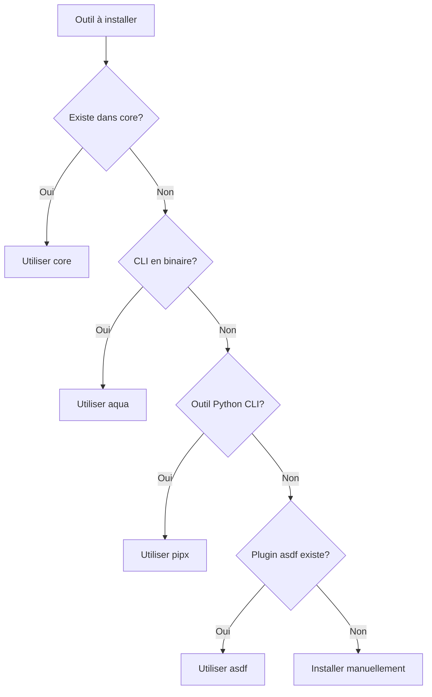

# Les backends `mise` : choisir la source de ses outils

> `mise` ne réinvente pas la roue : il s'appuie sur des backends existants pour installer vos outils. Comprendre ces backends permet de choisir la bonne source pour chaque outil et d'éviter les conflits ou les installations redondantes.

Dans [l'article précédent](https://www.sfeir.dev/standardiser-les-versions-de-vos-outils-avec-mise/), vous avez installé [`mise`](https://mise.jdx.dev/) et déclaré vos premières versions d'outils. Mais lorsque vous lancez `mise use java`, d'où vient réellement le binaire ? C'est le rôle des **backends** : les sources d'installation que `mise` interroge pour télécharger, compiler ou gérer vos outils.

`mise` dispose d'une [vingtaine de backends](https://mise.jdx.dev/dev-tools/backends/) (`cargo`, `npm`, `go`, `ubi`, `vfox`…). Cet article se concentre sur les 4 que vous rencontrerez au quotidien : `core`, `aqua`, `pipx` et `asdf`.

## Un `mise.toml` de projet réel

Voici le fichier `mise.toml` d'un projet qui combine une API Node.js, du provisioning Ansible et des outils d'infrastructure :

```toml
[tools]
node = "20"
python = "3.12"
"aqua:hadolint/hadolint" = "2.12.0"
"pipx:ansible" = "9.0.1"
"asdf:hashicorp-vault" = "1.15"
```

<!-- Exemple de mise.toml combinant les 4 backends : core, aqua, pipx et asdf -->

Cinq outils, trois syntaxes différentes. Pourquoi `node` s'écrit sans préfixe, alors que `hadolint` commence par `aqua:` ?

Lorsque vous ne spécifiez pas de backend, `mise` consulte son [registre](https://mise.jdx.dev/registry.html) pour déterminer automatiquement lequel utiliser. Le registre définit un backend par défaut pour chaque outil — `core` pour `node`, `aqua` pour `hadolint`, etc. Dans la majorité des cas, ce choix implicite suffit. Mais vous pouvez le **surcharger** avec un préfixe explicite (`aqua:`, `pipx:`, `asdf:`) pour forcer un backend différent de celui du registre.

Pour visualiser le backend associé à chaque outil, utilisez `mise registry` :

```bash
mise registry | grep hadolint
# hadolint  aqua:hadolint/hadolint
```

<!-- Consultation du registre mise pour voir le backend par défaut d'un outil -->

Décortiquons chaque ligne.

## `node` et `python` — le backend `core`

```toml
[tools]
node = "20"
python = "3.12"
```

<!-- Installation de Node 20 et Python 3.12 via le backend core -->

Pas de préfixe : `mise` utilise son backend **`core`**, développé et maintenu par l'équipe `mise`. C'est le choix par défaut et le plus performant.

Le backend `core` couvre les langages les plus courants :
`node`, `python`, `java`, `go`, `ruby`, `rust`, `bun`, `deno`, `elixir`, `erlang`, `zig`.

Ses atouts :
- **rapide** : optimisé pour `mise`, pas de dépendance externe
- **stable** : suivi des versions officielles, mises à jour régulières
- **sans configuration** : ça fonctionne directement

La règle est simple : **si l'outil existe dans `core`, utilisez `core`**. Pas besoin de spécifier le backend, `mise` le sélectionne automatiquement.

```bash
mise use node@20
```

<!-- Installation de Node 20 via le backend core de mise -->

## `hadolint` — le backend `aqua`

```toml
[tools]
"aqua:hadolint/hadolint" = "2.12.0"
```

<!-- Installation de hadolint via le backend aqua -->

`hadolint` est un linter pour Dockerfiles. Ce n'est pas un langage, et il n'existe pas dans `core`. En revanche, c'est un CLI distribué sous forme de binaire — exactement ce que couvre [**`aqua`**](https://aquaproj.github.io/).

Le backend `aqua` télécharge des **binaires pré-compilés** depuis GitHub. L'installation est quasi instantanée : pas de compilation, pas de dépendance système.

Ses atouts :
- **ultra-rapide** : téléchargement direct du binaire
- **large catalogue** : outils DevOps, CLI GitHub, linters, formatteurs
- **reproductible** : basé sur un registre versionné

Sa limite : `aqua` ne couvre pas les langages (Node, Python…) — c'est le rôle de `core`.

La syntaxe `aqua:hadolint/hadolint` suit le format `aqua:<owner>/<repo>` du registre aqua.

## `ansible` — le backend `pipx`

```toml
[tools]
"pipx:ansible" = "9.0.1"
```

<!-- Installation de ansible via le backend pipx -->

`ansible` est un outil CLI écrit en Python. On pourrait l'installer avec `pip`, mais cela polluerait l'environnement Python du projet. Le backend **`pipx`** résout ce problème : il installe chaque outil Python dans **son propre virtualenv**, isolé du reste.

Ses atouts :
- **isolation** : pas de conflits de dépendances Python entre outils
- **simplicité** : idéal pour les CLI Python (`ansible`, `black`, `ruff`, `poetry`)

Sa limite : uniquement pour des paquets [PyPI](https://pypi.org/). Si vous tentez `pipx:terraform`, vous aurez une erreur — Terraform n'est pas un paquet Python.

Si vous gérez déjà Python avec `mise` (via `core`), assurez-vous que `pipx` utilise bien ce Python :

```bash
mise which python
```

<!-- Vérification que pipx utilise le bon Python géré par mise -->

## `hashicorp-vault` — le backend `asdf`

```toml
[tools]
"asdf:hashicorp-vault" = "1.15"
```

<!-- Installation de hashicorp-vault via le backend asdf -->

Dernier recours, mais catalogue immense. Le backend **`asdf`** réutilise les plugins de l'écosystème [`asdf-vm`](https://github.com/asdf-vm/asdf-plugins) — des centaines de plugins communautaires couvrant des outils très spécifiques.

Ses atouts :
- **écosystème riche** : si un outil n'existe nulle part ailleurs, il existe probablement en plugin `asdf`
- **migration facile** : si vous venez d'`asdf`, vos plugins fonctionnent directement

Ses limites :
- **qualité variable** : certains plugins sont peu maintenus
- **plus lent** : scripts bash, parfois compilation depuis les sources
- **dépendances système** : certains plugins nécessitent des libs supplémentaires (ex : `libssl-dev` pour Ruby)

`mise` télécharge automatiquement les plugins `asdf`. Si l'installation échoue, vous pouvez forcer le téléchargement :

```bash
mise plugins install hashicorp-vault
```

<!-- Commande pour installer manuellement un plugin asdf -->

## Comment choisir le bon backend

Le raisonnement est toujours le même :


```mermaid
flowchart TD
    A[Outil à installer] --> B{Existe dans core?}
    B -->|Oui| C[Utiliser core]
    B -->|Non| D{CLI en binaire?}
    D -->|Oui| E[Utiliser aqua]
    D -->|Non| F{Outil Python CLI?}
    F -->|Oui| G[Utiliser pipx]
    F -->|Non| H{Plugin asdf existe?}
    H -->|Oui| I[Utiliser asdf]
    H -->|Non| J[Installer manuellement]
```

<!-- Diagramme de décision pour choisir le bon backend mise -->

Concrètement, avant d'ajouter un outil dans `mise.toml` :

1. Vérifiez s'il est dans `core` → `mise registry` pour lister les outils, `mise ls-remote <outil>` pour ses versions
2. Si c'est un CLI en binaire, cherchez dans le [registre aqua](https://aquaproj.github.io/)
3. Si c'est un outil Python, utilisez `pipx`
4. En dernier recours, cherchez un [plugin asdf](https://github.com/asdf-vm/asdf-plugins)
5. Spécifiez toujours une version exacte, pas `latest`
6. Testez l'installation avec `mise install` puis `mise doctor`

## Les pièges que vous rencontrerez

### Mauvais backend, mauvais résultat

```bash
mise use pipx:terraform
```

<!-- Erreur : Terraform n'est pas un paquet PyPI, le backend pipx ne convient pas -->

Terraform n'est pas un paquet PyPI. Cette commande échouera. Suivez l'arbre de décision : Terraform existe dans `core`, utilisez simplement `mise use terraform`.

### Plugin `asdf` introuvable

```
Error: asdf plugin hashicorp-vault not found
```

<!-- Erreur typique : plugin asdf manquant -->

`mise` télécharge les plugins automatiquement, mais en cas d'échec :

```bash
mise plugins install hashicorp-vault
```

<!-- Installation manuelle d'un plugin asdf -->

### Conflits Python entre `core` et `pipx`

Si vous installez `python` via `core` et `ansible` via `pipx`, vérifiez que `pipx` utilise le Python de `mise` et non celui du système. Un simple `mise which python` suffit à lever le doute.

## À retenir

- **`core` d'abord** : plus rapide, plus stable, maintenu par l'équipe `mise`. Si l'outil y est, ne cherchez pas plus loin.
- **Préfixe explicite** : dans `mise.toml`, `"aqua:hadolint/hadolint"` vaut mieux qu'un backend implicite. Documentez vos choix.
- **Un backend par besoin** : `aqua` pour les binaires, `pipx` pour Python, `asdf` en dernier recours.

## Pour aller plus loin

**Liens externes :**
- [Documentation officielle des backends](https://mise.jdx.dev/dev-tools/backends/)
- [Liste des outils core](https://mise.jdx.dev/dev-tools/)
- [Registre des plugins asdf](https://github.com/asdf-vm/asdf-plugins)
- [Site officiel aqua](https://aquaproj.github.io/)
- [Documentation pipx](https://pipx.pypa.io/)

**Liens internes sfeir.dev :**
- [Standardiser les versions de vos outils avec `mise`](https://www.sfeir.dev/standardiser-les-versions-de-vos-outils-avec-mise/) — article précédent de la série
