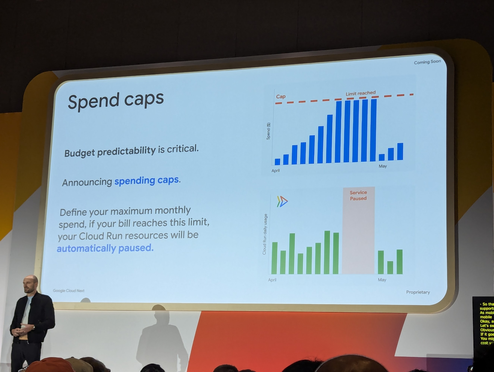

# Cloud Run, cuvée 2026 : 6 nouveautés en direct du Next

## En direct de Google Cloud Next

J'assiste en ce moment à la session Cloud Run du Google Cloud Next. Depuis sa première version, Cloud Run a beaucoup évolué : d'un runtime serverless HTTP minimaliste, il est devenu un socle capable d'encaisser des cas d'usage très variés — APIs, jobs, et maintenant workloads IA.

La session enchaîne les annonces. Voici les six que j'ai retenues.

## Spend caps : reprendre la main sur la facture

Prévoir sa facture GCP relève parfois du pari. Un service très sollicité, un pic de trafic inattendu, une boucle qui dérape — et le budget mensuel prend une tournure qu'on n'avait pas anticipée. Jusqu'ici, se protéger supposait d'assembler budgets, alertes, Cloud Functions et désactivations manuelles. Une plomberie que personne n'a envie d'écrire.

Les **spend caps** balayent ce bricolage. Vous définissez un plafond mensuel ; si Cloud Run l'atteint, vos services sont mis en pause automatiquement. Pas de script custom, pas de règle IAM tordue : une case à cocher.



<!-- Slide Google Cloud Next : "Spend caps — Define your maximum monthly spend, if your bill reaches this limit, your Cloud Run resources will be automatically paused." -->

💡 Le cas typique : un service légitimement gourmand en ressources. Vous fixez un cap **volontairement haut**, largement au-dessus de la consommation attendue. L'objectif n'est pas d'étrangler le service au quotidien, mais de poser un filet de sécurité contre la facture surprise — fuite mémoire, boucle infinie, ou attaque applicative.

## Service Bindings : le service-to-service enfin simple

Faire dialoguer deux services Cloud Run de manière privée et authentifiée demandait jusqu'ici un rituel bien connu : ingress interne, VPC connector ou Direct VPC Egress, IAM invoker, récupération manuelle d'un ID token à injecter dans l'en-tête `Authorization`. Chacun a déjà écrit ce code plus d'une fois.

Les **Service Bindings** remplacent tout ça par un lien déclaratif entre deux services. L'authentification JWT est injectée automatiquement, les appels sont monitorés, et les URLs deviennent lisibles : `curl https://backend` au lieu d'une URL `https://backend-xyz-uc.a.run.app`.


<!-- Slide Google Cloud Next : "Service Bindings — Streamlined and private service-to-service calls. Automatic JWT injection and monitoring. Simple service URLs: curl https://backend." -->

Trois commandes suffisent :

```bash
# 1. Frontend avec ambient networking régional
gcloud run deploy frontend \
  --ambient-networking=REGIONAL

# 2. Backend privé (non exposé sur internet)
gcloud run deploy backend --ingress=internal

# 3. Liaison entre les deux
gcloud network-services service-bindings create \
  --source=$FRONTEND_URI \
  --destination=$BACKEND_URI
```

<!-- Déploiement de deux services Cloud Run et création d'un Service Binding qui connecte le frontend au backend en privé, avec authentification gérée automatiquement -->

Techniquement, c'est ce qu'un service mesh (Istio, Linkerd) apporte à un cluster Kubernetes : identité par service, mTLS, découverte, observabilité. Livré cette fois sans cluster à opérer.

## Un serveur MCP officiel pour Cloud Run

Le Model Context Protocol s'impose comme le standard pour connecter un LLM à des outils externes. Google saute dans le train et publie un **serveur MCP officiel pour Cloud Run**. Concrètement, vos agents — Claude, Gemini, Cursor, ou le chat de votre choix — peuvent désormais piloter Cloud Run directement depuis la conversation.


<!-- Slide Google Cloud Next : "Fully Managed MCP Server — An official Cloud Run MCP (Model Context Protocol) server, making it even easier for you and your agents to deploy and manage Cloud Run apps. Tools: Deploy from container image, Deploy from source archive, Deploy from file content, List / Get services." -->

Les outils exposés couvrent l'essentiel du cycle de vie :

- **Deploy from container image** — à partir d'une image Docker existante
- **Deploy from source archive** — pour un build à partir d'une archive
- **Deploy from file content** — le plus bluffant : vous dictez le code à votre agent, il déploie
- **List / Get services** — introspection des services existants

En pratique, une demande du type *"déploie-moi ce script Python sur Cloud Run en europe-west9"* devient un aller simple dans votre IDE. Plus besoin de basculer vers la console ou `gcloud` pour valider un prototype.

## Déployer un agent IA sur Cloud Run

Google reconnaît l'agent IA comme un **nouveau type de workload** à part entière. Et ce workload ne ressemble à aucun autre.

Un agent, ce n'est pas juste un binaire qui répond à des requêtes HTTP. C'est un assemblage de briques aux besoins très différents :

- **Un harness** — le cerveau, qui appelle le modèle et orchestre les étapes
- **Une mémoire persistante** — pour garder le contexte entre les sessions
- **Des outils** — locaux ou distants, via CLI, API ou MCP
- **Un sandbox** — un environnement de calcul où l'agent manipule des fichiers, écrit du code, exécute des commandes


<!-- Slide Google Cloud Next : "AI Agents — A new type of workload. Made of a harness, a persistent memory, tools (local or remote), a sandbox (compute environment to work). The sandbox: a computer in the cloud. Cloud Run is an ideal runtime to safely and efficiently host agent harness, tools, and sandboxes." -->

Le sandbox est le morceau le plus intéressant : Google le décrit comme *"a computer in the cloud"*. Pour exécuter du code écrit par un LLM, lancer une CLI, ou appeler un MCP, l'agent a besoin d'un vrai runtime Linux isolé, à la demande, jetable.

Cloud Run coche toutes les cases : compute on-demand, facturation à l'usage, isolation forte entre instances. L'alternative classique — provisionner une VM dédiée par session d'agent — devient inutile.

## Cloud Run Instances : les workloads longs enfin servis

Jusqu'ici, Cloud Run raisonnait en *services* et en *jobs* — des primitives bien adaptées aux APIs et aux traitements batch. Mais dès qu'on sort de ce moule, rien ne colle : un agent de coding qui tourne plusieurs heures, un crawler qui explore un site pendant une nuit entière, un runner CI qui attend des événements — impossible à exprimer proprement.

**Cloud Run Instances** introduit une nouvelle primitive : vous pilotez une **instance individuelle**, au lieu de passer par un type de ressource prédéfini. Démarrage en quelques secondes, compute isolé à la demande, volumes montés depuis Cloud Storage.


<!-- Slide Google Cloud Next : "Cloud Run Instances — A New Primitive: Manage individual Cloud Run instances instead of through predefined resource types, starting in seconds. For Agents: Designed for asynchronous, long running, background agents needing isolated, on-demand compute. Price: $5.70 / month for 1 CPU (shared) + 1 GiB." -->

Un exemple en ligne de commande :

```bash
gcloud alpha run instances create \
  --image alpine/openclaw:latest \
  --port 18789 \
  --memory 4Gi \
  --default-url \
  --add-volume mount-path=/home/node/.openclaw,type=cloud-storage,bucket=$BUCKET_NAME
```

<!-- Commande gcloud pour créer une Cloud Run Instance avec une image, un port, 4 GiB de mémoire, une URL publique et un volume Cloud Storage monté -->

Et la même logique côté SDK Node :

```typescript
import { InstancesClient } from '@google-cloud/run';

new InstancesClient().createInstance({
  parent: 'projects/my-project/locations/europe-west9',
  instance: { containers: [{ image: 'steren/my-agent' }] },
});
```

<!-- SDK @google-cloud/run : création d'une instance Cloud Run depuis du code TypeScript -->

Le cas d'usage phare : un **agent de coding en arrière-plan** (pensez Claude Code ou Codex lancés en mode autonome sur une tâche de plusieurs heures). Mais la primitive s'ouvre à tout workload long asynchrone — scraping, simulation, CI runner éphémère.

💡 Autre bonus qui change la vie du débug : vous pouvez **SSH dans l'instance**. Un agent qui plante à la troisième heure d'exécution ? Plus besoin de rejouer le scénario en local ou de noyer vos logs de prints : vous entrez dans le container, vous regardez l'état, vous comprenez. C'est exactement ce qui manquait aux services Cloud Run jusqu'ici.

Côté prix : **$5.70 / mois** pour 1 CPU partagé et 1 GiB de RAM — de quoi laisser tourner des agents longue durée sans exploser le budget.

## Built-in dev loop : développer directement sur Cloud Run

On garde la meilleure pour la fin. Ou en tout cas, ma préférée.

Combien d'heures perdues à reproduire localement un environnement cloud ? Émulateurs approximatifs, docker-compose qui diverge du vrai prod, variables d'environnement à rejouer à la main… le coût caché du *dev local* est rarement regardé en face.

Google propose l'inverse : **arrêtez d'émuler le cloud sur votre laptop, développez directement sur Cloud Run**.


<!-- Slide Google Cloud Next : "Cloud Run Instances: Built-in dev loop — Stop trying to emulate the cloud on your laptop, just develop on Cloud Run. Automatic sync between local folder and Cloud Run. Running dev script in package.json." -->

Une seule commande suffit :

```bash
gcloud run instances dev sync my-node-app --source .
```

<!-- Lance une boucle de synchronisation live : le dossier local pousse ses changements vers une Cloud Run Instance, qui exécute le script dev -->

Derrière, la CLI établit une connexion persistante avec une Cloud Run Instance, surveille votre dossier local, et pousse chaque modification au fil de l'eau. Côté instance, le script `dev` de votre `package.json` tourne comme si vous étiez en local — hot reload inclus.

Ce que ça change concrètement :

- Pas de Dockerfile à reconstruire à chaque itération
- Pas de push d'image pour tester une ligne modifiée
- L'environnement d'exécution est le vrai — mêmes IAM, mêmes secrets, mêmes services GCP autour

La boucle *modifier → sauvegarder → voir le résultat* redevient instantanée, mais cette fois sur une infra réelle. Pour moi, c'est l'annonce qui change le plus la vie au quotidien.

## À retenir

Il y a quelques années, dès qu'un cas d'usage sortait du cadre "conteneur HTTP stateless", la discussion finissait invariablement par : *"il va falloir passer sur GKE"*. Kubernetes était la réponse par défaut pour tout workload un peu exigeant — long-running, stateful, multi-instances, besoin d'accès SSH, jobs asynchrones, agents en arrière-plan.

Ces annonces tirent un trait sur une bonne partie de ces exceptions. Relisez la liste :

- Les **spend caps** règlent la peur de la facture qui dérape, souvent citée comme raison de rester sur des VM ou GKE où la capacité est cappée au niveau du cluster
- Les **Service Bindings** apportent le service mesh managé que Kubernetes exige habituellement via Istio ou Linkerd
- Le **serveur MCP** fait entrer Cloud Run dans les workflows pilotés par agent, au même titre que n'importe quelle plateforme cloud moderne
- Le support explicite des **agents IA** adresse un type de workload que personne ne plaçait sur du serverless il y a encore six mois
- **Cloud Run Instances** — et son SSH — absorbe les workloads longs, asynchrones, et les scénarios de débug qui imposaient hier une VM ou un pod Kubernetes
- Le **built-in dev loop** court-circuite toute la chaîne minikube / tilt / skaffold / docker-compose

Cloud Run n'est plus un "serverless pour APIs". Le produit se transforme en plateforme de compute généraliste, qui adresse les APIs, les jobs, les agents, les workloads longs, et maintenant le développement lui-même. Le ticket d'entrée reste radicalement plus bas que Kubernetes : pas de cluster à gérer, pas de nœuds à patcher, pas de charts Helm à versionner.

La question *"est-ce que Cloud Run suffit pour mon cas ?"* reçoit de moins en moins souvent la réponse *"non"*. Et c'est bien ça, la vraie annonce de cette session.
